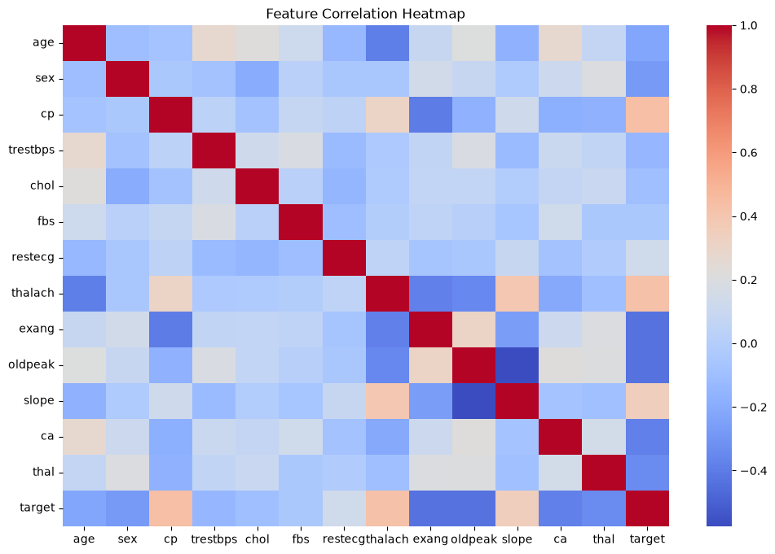
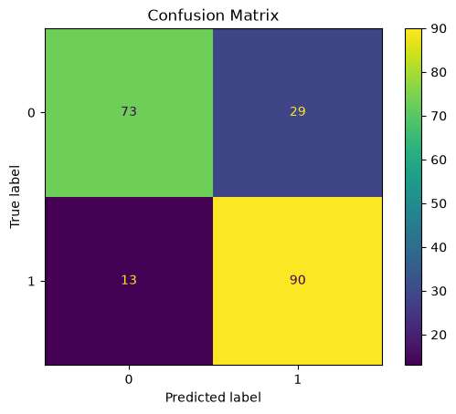
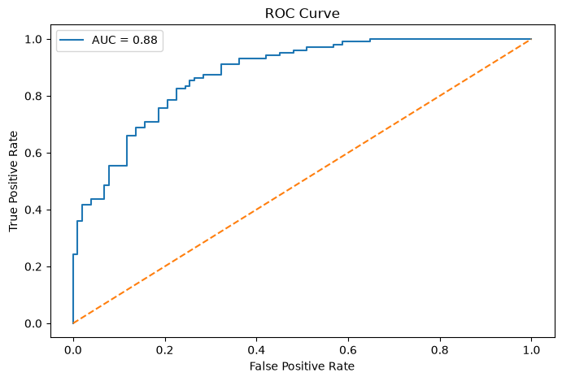

# ❤️ Heart Disease Prediction using Machine Learning

A machine learning project that predicts the risk of heart disease using patient health data.  
Includes data analysis, model training, evaluation, and a Streamlit web app.

---

## 🚀 Live Demo
https://heart-disease-prediction-kquqtnghveqm4la76wzwgq.streamlit.app/

---

## 📌 Project Overview
This project uses machine learning algorithms to predict whether a patient has heart disease based on medical attributes.

---

## 🧠 Features
- Data Cleaning & Preprocessing
- Exploratory Data Analysis (EDA)
- Logistic Regression Model
- Decision Tree Classifier
- Model Evaluation (Accuracy, ROC, Confusion Matrix)
- Feature Importance Analysis
- Streamlit Web App for predictions

---

## 📊 Dataset
- UCI Heart Disease Dataset (Kaggle)
- Features include:
  age, cholesterol, blood pressure, chest pain type, etc.

---

## ⚙️ Tech Stack
- Python
- Pandas, NumPy
- Scikit-learn
- Matplotlib, Seaborn
- Streamlit

---

## 📈 Model Performance
-Logistic Regression Accuracy: 0.7951219512195122
Decision Tree Accuracy: 0.9853658536585366
- Evaluation: ROC Curve, Confusion Matrix

---

## 🖥️ Web App
Users can input patient data and get instant predictions.

---

## 📸 Screenshots

### EDA

### Confusion Matrix

## 📌 Key Insights
- Chest pain type strongly influences heart disease prediction
- Age and maximum heart rate are key indicators
- Logistic Regression performed more stable than Decision Tree

### ROC Curve

---

## 📁 Project Structure
